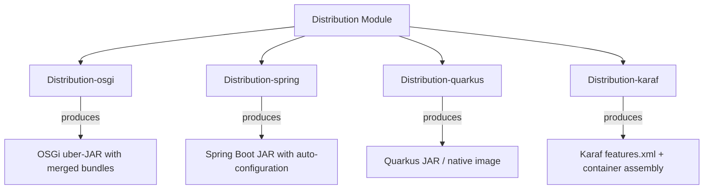

# Distribution Module

The **Distribution** module packages the Water Framework for deployment across multiple runtime environments: **OSGi (Karaf)**, **Spring Boot**, and **Quarkus**. It handles dependency merging, annotation index consolidation, and runtime-specific configuration to produce self-contained, deployable artifacts.

## Architecture Overview



## Sub-modules

| Sub-module | Description |
|---|---|
| **Distribution-osgi** | Produces an OSGi uber-JAR merging all Water bundles, with annotation index consolidation. Also packages Karaf container distributions. |
| **Distribution-spring** | Produces a Spring Boot JAR with `@EnableWaterFramework`, auto-configuration, JPA entity scanning, and embedded container. |
| **Distribution-quarkus** | Produces a Quarkus-compatible distribution supporting dev mode and native image compilation. |
| **Distribution-karaf** | Defines Karaf `features.xml` for modular deployment of Water bundles into an existing Karaf container. |

## Distribution Types

### OSGi Distribution

For enterprise OSGi applications running on Apache Karaf:

- **Hot deployment** of modules as OSGi bundles
- **Dynamic service registry** for runtime component management
- **Karaf features** for modular, versioned deployment

```bash
# Build OSGi uber-JAR
./gradlew :Distribution-osgi:osgiJar

# Build Karaf container distribution
./gradlew :Distribution-osgi:karafWaterDistributionBuild
```

### Spring Distribution

For standalone Spring Boot applications:

- **Self-contained JAR** with embedded web server
- **Auto-configuration** via `@EnableWaterFramework`
- **JPA integration** with automatic entity scanning

```bash
# Build Spring distribution
./gradlew :Distribution-spring:springJar

# Run
java -jar build/libs/Water-Distribution-spring.jar
```

### Quarkus Distribution

For cloud-native applications with fast startup:

- **Dev mode** with live reload
- **Native image** compilation via GraalVM
- **Low memory footprint** for containerized deployments

```bash
# Development mode
./gradlew :Distribution-quarkus:quarkusDev

# Production build
./gradlew :Distribution-quarkus:build
java -jar build/quarkus-app/quarkus-run.jar
```

### Karaf Features

For deploying Water modules into an existing Karaf container:

```bash
# In Karaf shell
feature:repo-add mvn:it.water.distribution/Water-distribution-karaf-features/3.0.0/xml/features
feature:install water-core-features
feature:install water-rest
```

## Configuration

### OSGi / Karaf

```properties
org.apache.karaf.features.repositories=mvn:it.water.distribution/Water-distribution-karaf-features/3.0.0/xml/features
org.apache.karaf.features.boot=water-core-features,water-rest
org.osgi.framework.bootdelegation=sun.*,com.sun.*,com.apple.*
```

### Spring Boot

```yaml
spring:
  datasource:
    url: jdbc:h2:mem:testdb
    driver-class-name: org.h2.Driver
  jpa:
    hibernate:
      ddl-auto: create-drop

water:
  framework:
    enabled: true
  security:
    jwt:
      enabled: true
```

### Quarkus

```properties
quarkus.http.port=8080
quarkus.datasource.db-kind=h2
quarkus.hibernate-orm.database.generation=drop-and-create
water.framework.enabled=true
```

## Build Properties

| Property | Description | Default |
|---|---|---|
| `waterVersion` | Water Framework version | — |
| `karafVersion` | Karaf container version | `4.4.6` |
| `publishRepoUrl` | Maven repository URL for publishing | — |
| `publishRepoUsername` | Repository username | — |
| `publishRepoPassword` | Repository password | — |

## How JAR Merging Works

The distribution modules use Gradle's Shadow plugin to create uber-JARs:

1. All Water module JARs are merged into a single artifact
2. `META-INF/annotations/` files from Atteo ClassIndex are **consolidated** across all included JARs
3. `DuplicatesStrategy.INCLUDE` ensures no resources are lost
4. `zip64` is enabled for large distributions

## Custom Karaf Features

To define custom Karaf features for your application:

```xml
<features xmlns="http://karaf.apache.org/xmlns/features/v1.2.0" name="My-App-Features">
    <feature name="my-app" version="1.0.0">
        <feature>water-core-features</feature>
        <feature>water-rest</feature>
        <bundle start-level="82">mvn:com.myapp/my-module/1.0.0</bundle>
    </feature>
</features>
```

## Dependencies

- **All Water modules** — Core, Repository, JpaRepository, Rest, Permission, Role, User, etc.
- **Apache Karaf** — OSGi container (for OSGi distribution)
- **Spring Boot** — Application framework (for Spring distribution)
- **Quarkus** — Cloud-native framework (for Quarkus distribution)
- **Gradle Shadow Plugin** — JAR merging and dependency packaging
